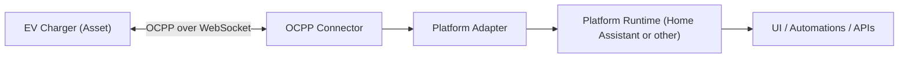

# OCPP Connector Overview (4.1.3)

## 1. Functional Overview

This repository contains an open-source OCPP connector for Home Assistant.

It started as a Home Assistant OCPP integration and was refactored in this fork so
the protocol core can be reused for other platforms with a platform adapter.

In plain language, this connector:

- opens and maintains WebSocket communication with EV chargers;
- handles OCPP message exchange for charger telemetry and control;
- exposes charger control and status to the platform runtime;
- translates protocol-level data into platform entities/services.

Supported protocols in this repository:

- OCPP 1.6
- OCPP 2.0.1
- OCPP 2.1

Supported device class:

- OCPP-compliant EV charge points (chargers), including multi-connector EVSE setups.

## 2. Integration Overview

### 2.1 How It Fits Into the Larger System



- The charger sends OCPP messages to the connector.
- The connector validates/processes messages and updates runtime state.
- The platform sends control signals (for example start/stop or setpoint updates)
  back through the connector to the charger.

### 2.2 Key Modules

- `custom_components/ocpp/chargepoint.py`: shared protocol core behavior
- `custom_components/ocpp/ocppv16.py`: OCPP 1.6 behavior
- `custom_components/ocpp/ocppv201.py`: OCPP 2.x behavior
- `custom_components/ocpp/platform_adapter.py`: platform abstraction boundary
- `custom_components/ocpp/api.py`: central system runtime orchestration

### 2.3 Dependencies and Compatibility

Primary dependencies:

- `ocpp`
- `websockets`
- Python `asyncio`

Platform dependency in this repo:

- Home Assistant runtime APIs

Compatibility notes:

- OCPP behavior is version-specific; not every OCPP action is implemented for every version.
- Python and OS differences can affect test behavior (for example Windows socket policies in tests).

## 3. Usage Instructions With Examples

### 3.1 Install (Step by Step)

1. Use Python 3.12 for test/dev workflows in this repo.
2. Create and activate a virtual environment.
3. Install requirements.

PowerShell example:

```powershell
cd "ocpp"
py -3.12 -m venv .venv
.\.venv\Scripts\Activate.ps1
python -m pip install -U pip setuptools wheel
pip install -r requirements.txt
```

### 3.2 Configure

At a minimum, configure:

- central system host/port;
- charge point IDs (path identity);
- desired OCPP subprotocol (`ocpp1.6`, `ocpp2.0.1`, `ocpp2.1`);
- optional authorization policy (`default_authorization_status`, `authorization_list`).

### 3.3 Run and Validate

1. Start platform runtime/integration.
2. Connect charger to matching WebSocket endpoint and subprotocol.
3. Verify boot registration and heartbeat.
4. Run control flows (remote start/stop, availability, profile commands).

### 3.4 Realistic Input/Output Payload Examples

#### Example A: OCPP 2.0.1 Boot Flow

Input (charger -> CSMS):

```json
[2,"52ca2bf0-8526-4bc1-8366-1201bc16cbfe","BootNotification",{"chargePointModel":"VirtualChargePoint","chargePointSerialNumber":"S001","chargePointVendor":"Solidstudio","firmwareVersion":"1.0.0"}]
```

Expected output (CSMS -> charger):

```json
[3,"52ca2bf0-8526-4bc1-8366-1201bc16cbfe",{"currentTime":"2026-04-21T06:43:35Z","interval":3600,"status":"Accepted"}]
```

Expected behavior:

- asset is marked connected/registered;
- runtime starts normal telemetry and control path.

#### Example B: OCPP 2.0.1 Smart Charging Capability

Input (charger -> CSMS), after `GetBaseReport`:

```json
{
  "requestId": 1,
  "generatedAt": "2026-04-21T12:00:00Z",
  "seqNo": 0,
  "reportData": [
    {
      "component": { "name": "SmartChargingCtrlr" },
      "variable": { "name": "Available" },
      "variableAttribute": [{ "type": "Actual", "value": "true" }]
    }
  ],
  "tbc": false
}
```

Expected behavior:

- platform marks smart charging capability available for the asset;
- control signals with charging setpoints can be sent.

## 4. Troubleshooting

- **Subprotocol mismatch**
  - Confirm charger uses the expected subprotocol and WebSocket path.
- **CallError / NotImplemented**
  - Action is recognized but no handler is implemented on receiver side.
- **Type/schema errors**
  - Check payload types and required fields.
- **UI state does not reflect session**
  - Verify session-related messages (start/charging/stop) are emitted for that OCPP version.
- **Tests fail on Windows but pass on Ubuntu**
  - Check Python version and pytest socket policy.

## 5. Contribution and Governance

Contribution process:

1. Open an issue (bug/feature/question) with reproducible context.
2. Create a branch and implement changes with tests.
3. Submit PR with rationale, scope, and compatibility notes.

Transparent review and approval:

- PR review comments are public in the repository.
- At least one maintainer approval required before merge.
- Breaking or compatibility-impacting changes require explicit migration notes.

Request channels:

- Issues for defects and improvements
- Discussions (if enabled) for design questions
- PRs for code/documentation changes

## 6. Versioning and Changelog Policy

Semantic versioning is mandatory.

Project policy for initial release phase:

- Versions must remain in `0.x.y` range during initial release work.
- The first major release (`1.0.0`) is planned at the end of the initial release.

Changelog requirements:

- Every release must include Added/Changed/Fixed (and Deprecated/Removed when applicable).
- Compatibility-impacting changes must be highlighted clearly.
- Documentation must match the released version.
- The canonical release history for this repository is [changelog.md](changelog.md).

## 7. Terminology and Documentation Format

Use these terms consistently across connector docs:

- **asset**: the managed charger/device in the system context
- **setpoint**: desired control target value (for example current limit)
- **control signal**: runtime command sent to influence charger behavior
- **connector / EVSE / charge point / CSMS**: follow OCPP definitions consistently

Formatting standards:

- English language
- Markdown only (no binary doc formats)
- Stable section order across docs (overview, integration, usage, troubleshooting, governance, versioning)

## 8. Documentation Repository and Access

Documentation is stored in version control next to source code:

- `ocpp/docs/*.md`

Access model:

- Markdown files in the repository (reviewable via PRs)
- No binary document artifacts required

## 9. Template Repository

A template repository will be provided for this documentation model.

When available, this connector docs set should align to that template structure and terminology guide to keep cross-connector documentation consistent.

